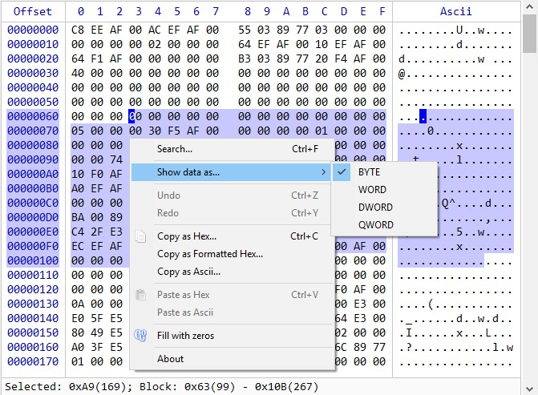
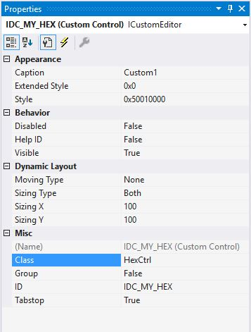

## **Hex control for MFC applications**

### Table of Contents
* [Introduction](#introduction)
* [Implementation](#implementation)
* [Using the Code](#using-the-control)
* [Create](#create)
  * [In Dialog](#in-dialog)
* [SetData](#setdata)
* [Virtual Mode](#virtual-mode)
* [OnDestroy](#ondestroy)
* [Scroll Bars](#scroll-bars)
* [Methods](#methods)
* [Example](#example)
* [Positioning and Sizing](#positioning-and-sizing)
* [Appearance](#appearance)
* [Licensing](#licensing)

### [](#)Introduction
Being good low level wrapper library for Windows API in general, MFC was always lacking a good native controls support.
This always forced people to implement their own common stuff for everyday needs.

This HEX control is a tiny attempt to expand standard MFC functionality, because at the moment, MFC doesn't have native support for such feature.

### [](#)Implementation
This HEX control is implemented as `CWnd` derived class, and can be used as a child or float window in any place of your existing MFC application. Control was build and tested in Visual Studio 2017 under Windows 10.

### [](#)Using the Control
The usage is quite simple:
1. Copy `HexCtrl` folder into your project subfolder.
2. Add all files from `HexCtrl` folder into your project.
3. Add `#include "HexCtrl/HexCtrl.h"` where you suppose to use the control.
4. Declare `CHexCtrl` member variable: `CHexCtrl myHex;`
5. Call `myHex.Create` method to create control instance.
6. Call `myHex.SetData` method to set the actual data to display as hex.

Control uses its own namespace - `HEXCTRL`. So it's up to you, to use namespace prefix, `HEXCTRL::`, or to define namespace in the file's beginning: `using namespace HEXCTRL;`.

### [](#)Create
`CHexCtrl::Create` method - the first method you call - takes `HEXCREATESTRUCT` as its argument. This is the main initialization struct which fields are described below:

```cpp
struct HEXCREATESTRUCT
{
	PHEXCOLORSTRUCT pstColor { };			//Pointer to HEXCOLORSTRUCT, if nullptr default colors are used.
	CWnd*		    pwndParent { };			//Parent window's pointer.
	UINT		    uId { };				//Hex control Id.
	DWORD			dwExStyles { };			//Extended window styles.
	CRect			rect { };				//Initial rect. If null, the window is screen centered.
	const LOGFONTW* pLogFont { };			//Font to be used, nullptr for default.
	CWnd*			pwndMsg { };			//Window ptr that is to recieve command messages, if nullptr parent window is used.
	bool			fFloat { false };		//Is float or child (incorporated into another window)?.
	bool			fCustomCtrl { false };	//It's a custom dialog control.
};
```

You can choose whether control will behave as a child or independent floating window by setting `fFloat` member of this struct.
```cpp
HEXCREATESTRUCT hcs;
hcs.fFloat = true;
bool Create(hcs);
```
`PHEXCOLORSTRUCT pstColor` member of `HEXCREATESTRUCT` points to the `HEXCOLORSTRUCT` struct which fields are described below:
```cpp
struct HEXCOLORSTRUCT 
{
	COLORREF clrTextHex { GetSysColor(COLOR_WINDOWTEXT) };		//Hex chunks color.
	COLORREF clrTextAscii { GetSysColor(COLOR_WINDOWTEXT) };	//Ascii text color.
	COLORREF clrTextSelected { GetSysColor(COLOR_WINDOWTEXT) }; //Selected text color.
	COLORREF clrTextCaption { RGB(0, 0, 180) };					//Caption color
	COLORREF clrTextInfoRect { GetSysColor(COLOR_WINDOWTEXT) };	//Text color of the bottom "Info" rect.
	COLORREF clrTextCursor { RGB(255, 255, 255) };				//Cursor text color.
	COLORREF clrBk { GetSysColor(COLOR_WINDOW) };				//Background color.
	COLORREF clrBkSelected { RGB(200, 200, 255) };				//Background color of the selected Hex/Ascii.
	COLORREF clrBkInfoRect { RGB(250, 250, 250) };				//Background color of the bottom "Info" rect.
	COLORREF clrBkCursor { RGB(0, 0, 250) };					//Cursor background color.
};
using PHEXCOLORSTRUCT = HEXCOLORSTRUCT * ;
```
This struct is also used in `CHexCtrl::SetColor` method.

### [](#)In Dialog
To use `HexCtrl` within `Dialog` you can create it with the standard routine: call `Create` method and provide all the necessary information.
But there is another approach you can use:
1. Put **Custom Control** control from the Toolbox in Visual Studio dialog designer into your dialog template and make it desired size.<br>
 
2. Then go to the **Properties** of that control, and in the **Class** field, within the **Misc** section, write _HexCtrl_. Give the control appropriate 
**ID** of your choise (`IDC_MY_HEX` in this example). Also, here you can set the control's **Dynamic Layout** properties, so that control behaves appropriately when dialog is being resized.

3. Declare `CHexCtrl` member varable within your dialog class: `CHexCtrl m_myhex;`
4. Add the folowing code to the `DoDataExchange` method of your dialog class:<br>
```cpp
DDX_Control(pDX, IDC_MY_HEX, m_myhex);
```
So, that it looks like in the example below:
```cpp
void CMyDlg::DoDataExchange(CDataExchange* pDX)
{
	CDialogEx::DoDataExchange(pDX);
	DDX_Control(pDX, IDC_MY_HEX, m_myhex);
}
```
5. Declare `HEXCREATESTRUCT` variable, set its `fCustomCtrl` field to true, and call `m_myhex.Create` method.

### [](#)SetData
`SetData` method takes `HEXDATASTRUCT` reference as argument. This struct fields are described below:
```cpp
struct HEXDATASTRUCT 
{
	ULONGLONG		ullDataSize { };		//Size of the data to display, in bytes.
	ULONGLONG		ullSelectionStart { };	//Set selection at this position. Works only if ullSelectionSize > 0.
	ULONGLONG		ullSelectionSize { };	//How many bytes to set as selected.
	CWnd*			pwndMsg { };			//Window to send the control messages to. If nullptr then the parent window is used.
	unsigned char*	pData { };				//Pointer to the data. Not used if it's virtual control.
	bool			fMutable { false };		//Will data be mutable (editable) or just read mode.
	bool			fVirtual { false };		//Is Virtual data mode?.
};
```
### [](#)Virtual Mode
The `fVirtual` member of `HEXDATASTRUCT` shows whether `HexControl` works in Virtual Mode.<br>
What it means is that when control is about to display next byte, it will first ask for this byte's value from `HEXDATASTRUCT::pwndMsg` window, 
in the form of `WM_NOTIFY` message. This is pretty much the same as the standard `MFC List Control` works when it's created with `LVS_OWNERDATA` flag.<br> 
This mode can be quite useful, for instance, in cases where you need to display a very large amount of data that can't fit in memory all at once.<br>
`void SetData(const HEXDATASTRUCT& hds);`

In control's parent window, process `WM_NOTIFY` message as follows:
```cpp
BOOL CMyWnd::OnNotify(WPARAM wParam, LPARAM lParam, LRESULT* pResult)
{
    PHEXNOTIFYSTRUCT pHexNtfy = (PHEXNOTIFYSTRUCT)lParam;
    if (pHexNtfy->hdr.idFrom == IDC_MY_HEX_CTRL)
    {
        switch (pHexNtfy->hdr.code)
        {
        case HEXCTRL_MSG_GETDATA:
            pHexNtfy->chByte = /*code for set given byte data*/;
            break;
        }
   }
}
```
`lParam` will hold a pointer to a `HEXNOTIFYSTRUCT` structure, which is described below:
```cpp
struct HEXNOTIFYSTRUCT
{
	NMHDR			hdr;			//Standard Windows header. For hdr.code values see HEXCTRL_MSG_* messages.
	ULONGLONG		ullByteIndex;	//Index of the start byte to get/send.
	ULONGLONG		ullSize;		//Size of the bytes to send.
	unsigned char	chByte;			//Value of the byte to get/send.
};
using PHEXNOTIFYSTRUCT = HEXNOTIFYSTRUCT * ;
```
Its first member is a standard Windows' `NMHDR` structure. It will have its code member equal to `HEXCTRL_MSG_GETDATA` indicating that HexControl's byte request has arrived.
The second member is the index of the byte be displayed. And the third is the actual byte, that you have to set in response.

### [](#)OnDestroy
When `HexControl` window, floating or child, is destroyed, it sends `WM_NOTIFY` message to its parent window with `NMHDR::code` equal to `HEXCTRL_MSG_DESTROY`. 
So, it basically indicates to its parent that the user clicked close button, or closed window in some other way.

### [](#)Scroll Bars
When I started to work with very big files, I immediately faced one very nasty inconvenience:
The standard Windows scrollbars can hold only signed integer value, which is too little to scroll through many gigabytes of data. 
It could be some workarounds and crutches involved to overcome this, but frankly saying i'm not a big fan of this kind of approach.

That's why HexControl uses its own scrollbars. They work with unsigned long long values, which is way bigger than standard signed ints. 
These scrollbars behave as normal Windows scrollbars, and even reside in the non client area, as the latter do.
### [](#)Methods
CHexCtrl class has a set of methods, that you can use to customize your control's appearance. These methods' usage is pretty straightforward and clean from their naming:
```cpp
void SetData(const HEXDATASTRUCT& hds); //Main method for setting data to display (and edit).
void ClearData();           //Clears all data from HexCtrl's view (not touching data itself).
void SetCapacity(DWORD dwCapacity);
void SetFont(const LOGFONT* pLogFontNew);
void SetFontSize(UINT nSize);
void SetColor(const HEXCOLORSTRUCT& clr);
void ShowOffset(ULONGLONG ullOffset, ULONGLONG ullSize = 1);
```
### [](#)Example
The function you use to set a data to display as hex is `CHexCtrl::SetData`. 
The code below constructs `CHexCtrl` object and displays first `0x1FF` bytes of your app's memory:
```cpp
CHexCtrl myHex.
HEXCREATESTRUCT hcs;
hcs.pwndParent = this;
myHex.Create(hcs);

HEXDATASTRUCT hds;
hds.pData = (unsigned char*)GetModuleHandle(0);
hds.ullDataSize = 0x1FF;
myHex.SetData(hds);
```
The next example displays `std::string`'s text string as hex:
```cpp
std::string str = "My string";
HEXDATASTRUCT hds;
hds.pData = (unsigned char*)str.data();
hds.ullDataSize = str.size();
myHex.SetData(hds);
```
### [](#)Positioning and Sizing
To properly resize and position your `HexControl`'s window you may have to handle `WM_SIZE` message in its parent window, in something like this way:
```cpp
void CMyWnd::OnSize(UINT nType, int cx, int cy)
{
    .
    .
    myHex.SetWindowPos(this, 0, 0, cx, cy, SWP_NOACTIVATE | SWP_NOZORDER);
}
```
### [](#)Appearance
To change control's font size - **«Ctrl+MouseWheel»**  
To change control's capacity - **«Ctrl+Shift+MouseWheel»**

### [](#)Licensing
This software is available under the **"MIT License modified with The Commons Clause".**
[https://github.com/jovibor/HexCtrl/blob/master/LICENSE](https://github.com/jovibor/HexCtrl/blob/master/LICENSE)